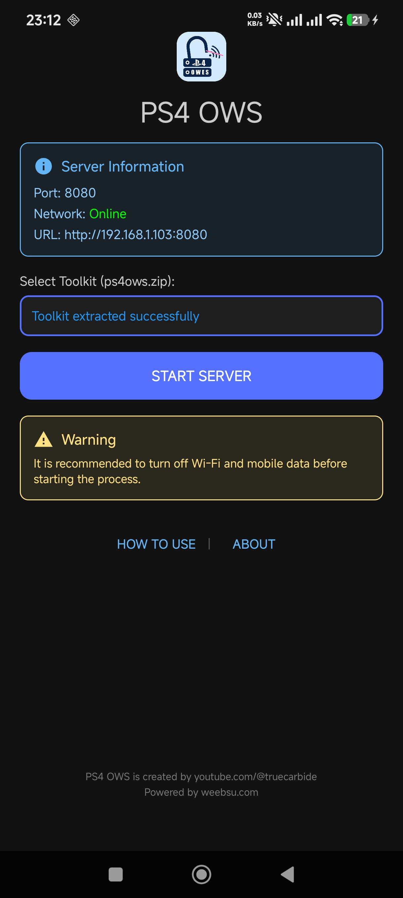
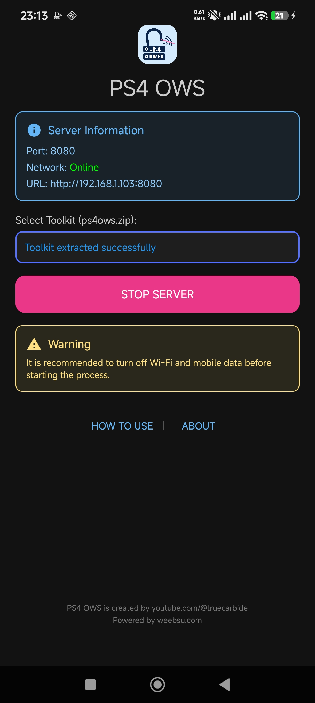

# PS4 OWS — Offline Webkit Server (v1.0.1)

**PS4 OWS** is a lightweight Android application designed to host PS4 files locally from your device. It eliminates the need for an internet connection by turning your Android phone into a local HTTP server that your PS4 can access.

## Features

- **Local HTTP Server**: Hosts web files directly from your Android device.
- **Offline Functionality**: Works without internet data or external Wi-Fi (supports Hotspot mode).
- **Select Method**: Choose between **Default Toolkit** and **Custom** hosting methods.
  - **Default Toolkit**: Select and verify official built-in ZIP toolkits (`ps4ows.zip`, `ps4ows.rawgame4.v1.zip`, `ps4ows.raw13g.v1.zip`) with SHA-256 integrity verification.
  - **Custom Method**: Host web files directly from a custom `ps4ows` folder located in your internal storage (`/sdcard/ps4ows`).
- **Real-time Monitoring**: Automatically detects and displays your current IP address and server status.
- **Privacy Focused**: No trackers, no analytics, no ads, and no cloud dependencies.

## Screenshots

<p align="center">
  
  
</p>

## Requirements

- **Android Version**: 7.0 (Nougat) or higher (API 24+).
- **Network**: Wi-Fi or Mobile Hotspot capability.

## How to Use

1. **Prepare Connection**: It is recommended to turn off Mobile Data and external Wi-Fi. 
2. **Connect**: Enable your Mobile Hotspot and connect your PS4 to it, or ensure both devices are on the same local network.
3. **Select Method & Source**:
   - **Method 1 (Default Toolkit)**: Select one of the supported official ZIP files. Automatic SHA-256 integrity check will verify the file:
     - `ps4ows.zip` (Checksum: `3024070420f67d102d886cc9e785e36b70144693e50ca9ddee35c8a6dfdc1185`)
     - `ps4ows.rawgame4.v1.zip` (Checksum: `5ad8785f53a6f565fd70c14a0791cc34fdf7798e1633ae7b2a8b520740701c15`)
     - `ps4ows.raw13g.v1.zip` (Checksum: `7b000d912db10ed2cd638c30a9ac794a2d0e87394090396a1305c67e1c8fc16b`)
   - **Method 2 (Custom)**: Create a folder named `ps4ows` in your phone's internal storage (`/sdcard/ps4ows`) containing your custom web host files (`index.html`, etc.).
4. **Start Server**: Tap the **[Start Server]** button.
5. **Access on PS4**: 
   - Note the URL displayed (e.g., `http://192.168.x.x:8080`).
   - On your PS4, open the **Web Browser** or **User's Guide**.
   - Type in the URL provided by the app.

## Build from Source

You can build this project using Android Studio or via command line:

```bash
./gradlew assembleDebug
```

The output APK will be located in `app/build/outputs/apk/debug/`.

## Project Structure

- `app/src/main/java`: Kotlin source code (Server logic and UI).
- `app/src/main/res`: UI layouts and resources.

## Credits

- **PS4 Web Toolkits**: [rawgame4.github.io](https://rawgame4.github.io)
- **GoldHEN**: [Sistro](https://ko-fi.com/sistro)
- **HTTP Server**: [NanoHTTPD](https://github.com/NanoHttpd/nanohttpd)

## License

This project is licensed under the **GNU General Public License v3.0**. See the [LICENSE](LICENSE) file for details.

---
*Created by [youtube.com/@truecarbide](https://youtube.com/@truecarbide) | Powered by [weebsu.com](https://weebsu.com)*
